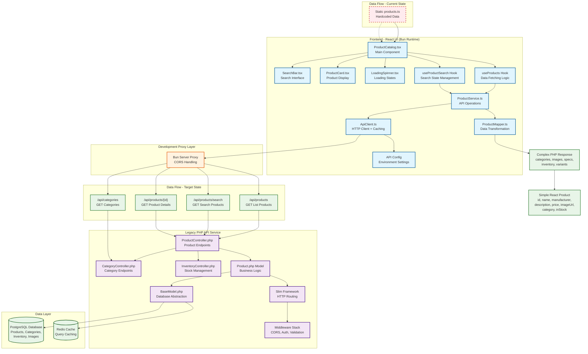
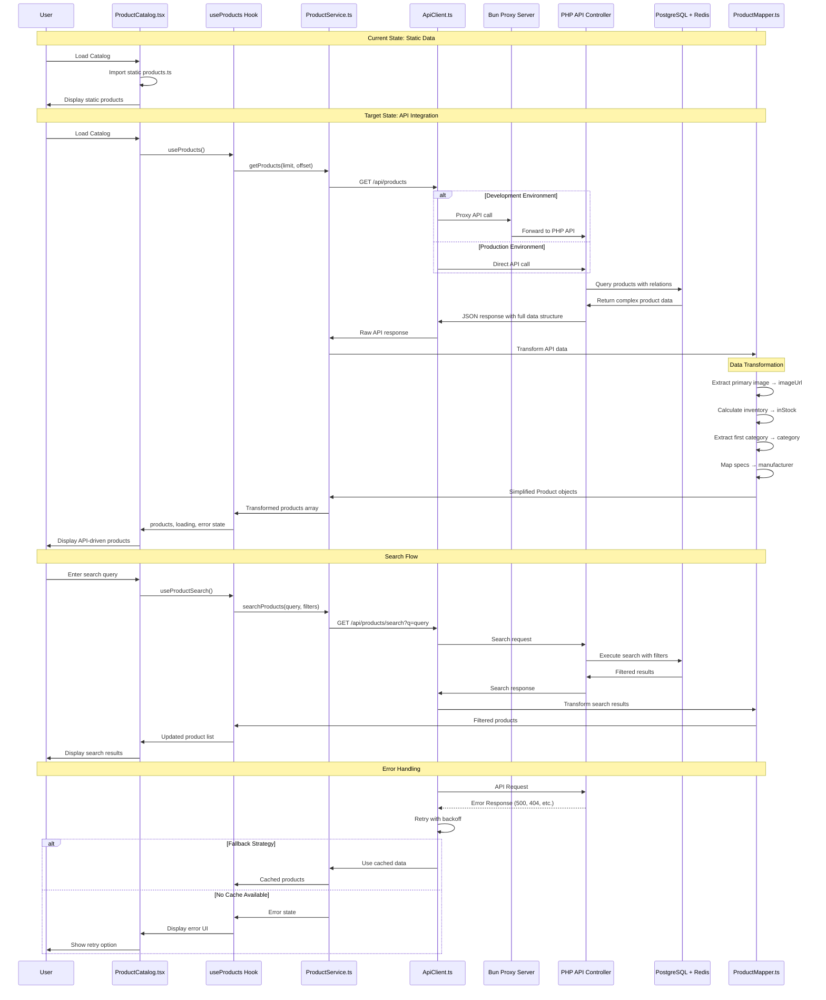

# Product Catalog Integration Plan

## Overview
This document outlines the integration plan for connecting the React-based `ProductCatalog.tsx` component with the legacy PHP Product Catalog API service. The integration will transform the current static data implementation into a dynamic, API-driven catalog.

## Current State Analysis

### React Frontend (product-catalog-ui)
- **Framework**: React with TypeScript, using Bun for runtime/building
- **Current Data**: Static array in `src/data/products.ts`
- **Product Interface**: Simple structure with 8 fields (id, name, manufacturer, description, price, imageUrl, category, inStock)
- **Features**: Basic search, product grid, detail view, loading/error states
- **Styling**: Tailwind CSS
- **Server**: Bun.serve with HTML imports

### Legacy PHP API (legacy-product-catalog-php-service)
- **Framework**: Slim 4 with PHP 8.1+
- **Database**: PostgreSQL with Redis caching
- **API Base Path**: `/api`
- **Authentication**: JWT-based with user roles
- **Rich Data Model**: Complex product structure with relations (categories, images, specifications, variants, inventory)

## Data Structure Mapping

### Current React Product Interface
```typescript
interface Product {
  id: string;
  name: string;
  manufacturer: string;
  description: string;
  price: number;
  imageUrl?: string;
  category?: string;
  inStock: boolean;
}
```

### PHP API Product Response (from `toArrayWithRelations()`)
```json
{
  "id": "uuid",
  "sku": "string",
  "name": "string",
  "slug": "string", 
  "description": "text",
  "short_description": "string",
  "price": "decimal",
  "compare_at_price": "decimal",
  "cost": "decimal",
  "status": "enum",
  "featured": "boolean",
  "weight": "decimal",
  "meta_title": "string",
  "meta_description": "string",
  "created_at": "timestamp",
  "updated_at": "timestamp",
  "categories": [{"id": "uuid", "name": "string", "slug": "string", ...}],
  "tags": [{"id": "uuid", "name": "string", "slug": "string"}],
  "images": [{"id": "uuid", "url": "string", "alt_text": "string", "is_primary": "boolean", "display_order": "int"}],
  "specifications": [{"id": "uuid", "name": "string", "value": "string", "display_order": "int"}],
  "variants": [{"id": "uuid", "sku": "string", "name": "string", "price": "decimal", ...}],
  "inventory": {"product_id": "uuid", "quantity": "int", "low_stock_threshold": "int", "status": "enum"}
}
```

## Implementation Plan

### Phase 1: API Service Layer (Week 1)

#### 1.1 Create API Configuration
- **File**: `src/config/api.ts`
- **Purpose**: Centralized API configuration
- **Contents**:
  ```typescript
  export const API_CONFIG = {
    BASE_URL: process.env.API_BASE_URL || 'http://localhost:8080/api',
    TIMEOUT: 10000,
    CACHE_TTL: 5 * 60 * 1000 // 5 minutes
  };
  ```

#### 1.2 Create API Client Service  
- **File**: `src/services/ApiClient.ts`
- **Purpose**: HTTP client with error handling, retries, caching
- **Features**:
  - Fetch-based HTTP client
  - Request/response interceptors
  - Error handling and retry logic
  - Request caching with TTL
  - TypeScript-first approach

#### 1.3 Create Product API Service
- **File**: `src/services/ProductService.ts` 
- **Purpose**: Product-specific API operations
- **Methods**:
  - `getProducts(limit?, offset?): Promise<ProductApiResponse>`
  - `searchProducts(query, filters?, limit?, offset?): Promise<ProductApiResponse>`
  - `getProduct(id): Promise<Product>`
  - `getCategories(): Promise<Category[]>`

### Phase 2: Data Transformation Layer (Week 1-2)

#### 2.1 Enhanced TypeScript Interfaces
- **File**: `src/types/Product.ts` (update)
- **New Interfaces**:
  ```typescript
  // Enhanced Product interface (backward compatible)
  interface Product {
    id: string;
    name: string;
    manufacturer: string;  // derived from specifications or manual mapping
    description: string;
    price: number;
    imageUrl?: string;    // derived from primary image
    category?: string;    // derived from first category
    inStock: boolean;     // derived from inventory.quantity > 0
    
    // Extended fields (optional)
    sku?: string;
    slug?: string;
    shortDescription?: string;
    compareAtPrice?: number;
    featured?: boolean;
    categories?: Category[];
    images?: ProductImage[];
    specifications?: ProductSpecification[];
    inventory?: Inventory;
  }

  // API-specific types
  interface ProductApiResponse {
    data: ProductApiData[];
    meta: {
      total: number;
      limit: number;
      offset: number;
    };
  }

  interface ProductApiData {
    // Full PHP API response structure
  }
  ```

#### 2.2 Create Data Mapper
- **File**: `src/services/ProductMapper.ts`
- **Purpose**: Transform PHP API data to React interface
- **Key Functions**:
  ```typescript
  export class ProductMapper {
    static apiToProduct(apiData: ProductApiData): Product {
      // Map PHP API response to React Product interface
      // Handle manufacturer extraction from specs/categories
      // Determine primary image
      // Calculate inStock from inventory
    }
    
    static apiToProducts(apiResponse: ProductApiResponse): Product[] {
      // Transform array of API products
    }
  }
  ```

### Phase 3: State Management & Data Fetching (Week 2)

#### 3.1 Create Custom Hooks
- **File**: `src/hooks/useProducts.ts`
- **Purpose**: Encapsulate product data fetching logic
- **Features**:
  ```typescript
  export function useProducts() {
    return {
      products: Product[],
      loading: boolean,
      error: string | null,
      refetch: () => Promise<void>,
      loadMore: () => Promise<void>
    };
  }

  export function useProductSearch(initialQuery = '') {
    return {
      searchQuery: string,
      setSearchQuery: (query: string) => void,
      filteredProducts: Product[],
      loading: boolean,
      error: string | null
    };
  }
  ```

#### 3.2 Update ProductCatalog Component
- **File**: `src/components/ProductCatalog.tsx` (update)
- **Changes**:
  - Replace static `products` import with `useProducts()` hook
  - Replace local search logic with `useProductSearch()` hook
  - Add pagination support
  - Enhanced error handling
  - Add retry mechanisms

### Phase 4: Environment & Configuration (Week 2-3)

#### 4.1 Environment Configuration
- **File**: `.env` (create)
- **Contents**:
  ```env
  API_BASE_URL=http://localhost:8080/api
  API_TIMEOUT=10000
  CACHE_ENABLED=true
  CACHE_TTL=300000
  NODE_ENV=development
  ```

#### 4.2 Development Proxy Setup
- **Purpose**: Handle CORS during development
- **Implementation**: Update Bun server to proxy API calls
- **File**: `src/index.tsx` (update)
- **Add API Proxy Route**:
  ```typescript
  "/api/*": {
    async GET(req) {
      const url = new URL(req.url);
      const apiUrl = `${API_CONFIG.BASE_URL}${url.pathname.replace('/api', '')}${url.search}`;
      return fetch(apiUrl);
    }
    // Add other HTTP methods
  }
  ```

### Phase 5: Advanced Features (Week 3-4)

#### 5.1 Enhanced Search & Filtering
- **New Component**: `src/components/SearchFilters.tsx`
- **Features**:
  - Category filter dropdown
  - Price range slider
  - Manufacturer filter
  - Featured products toggle
- **API Integration**: Use PHP API's advanced search endpoint with filters

#### 5.2 Categories Integration
- **New Service**: Category management
- **New Component**: Category navigation
- **API Endpoint**: `/api/categories`

#### 5.3 Product Detail Enhancements  
- **Features**:
  - Multiple product images carousel
  - Product specifications table
  - Product variants (if applicable)
  - Related products
  - Inventory status and availability

### Phase 6: Performance & Caching (Week 4)

#### 6.1 Client-Side Caching
- **Implementation**: In-memory cache with TTL
- **Strategy**: Cache product lists, individual products, categories
- **Cache Keys**: Based on query parameters and filters

#### 6.2 Pagination & Infinite Scroll
- **Implementation**: Cursor-based or offset-based pagination
- **UI**: Load more button or infinite scroll
- **Caching**: Merge paginated results efficiently

#### 6.3 Image Optimization
- **Lazy Loading**: Implement for product images
- **Responsive Images**: Multiple sizes based on context
- **Fallback Handling**: Default images for missing imageUrl

## Technical Considerations

### Error Handling Strategy
1. **Network Errors**: Retry with exponential backoff
2. **API Errors**: Display user-friendly messages
3. **Validation Errors**: Handle malformed API responses
4. **Fallback**: Option to fall back to static data during API issues

### Authentication (Future Phase)
- **Current**: PHP API has JWT authentication 
- **React Integration**: Add auth context/hooks if needed
- **Public Access**: Ensure product catalog endpoints don't require auth

### Performance Optimizations
1. **Request Batching**: Batch multiple API calls
2. **Response Compression**: Ensure PHP API returns compressed responses
3. **Caching Headers**: Utilize HTTP caching where appropriate
4. **Debounced Search**: Prevent excessive API calls during search

### Data Consistency
- **Cache Invalidation**: Strategy for refreshing stale data
- **Real-time Updates**: Consider WebSocket for inventory updates
- **Optimistic Updates**: For better UX in admin operations

## Development Workflow

### Local Development Setup
1. **PHP API**: Run legacy service on `localhost:8080`
2. **React UI**: Run Bun dev server on `localhost:3000`
3. **Database**: PostgreSQL + Redis running locally
4. **Proxy**: Configure API proxy in Bun server

### Testing Strategy
1. **Unit Tests**: Test data mappers, services, hooks
2. **Integration Tests**: Test API integration end-to-end
3. **Mock API**: Create mock server for frontend testing
4. **Error Scenarios**: Test network failures, API errors

### Deployment Considerations
1. **Environment Variables**: Proper API URL configuration
2. **CORS**: Configure PHP API for production domain
3. **Build Process**: Ensure API configuration in build
4. **Health Checks**: API availability monitoring

## Migration Strategy

### Phase Rollout
1. **Development**: Complete integration on dev environment
2. **Staging**: Test with production-like data
3. **Canary**: Gradual rollout with feature flags
4. **Full Migration**: Complete switch to API-driven catalog

### Rollback Plan
- **Feature Flag**: Toggle between static and API data
- **Static Fallback**: Maintain static data as backup
- **Monitoring**: API health monitoring with automatic fallback

### Data Migration
- **Product Data**: Ensure PHP API has required product data
- **Image URLs**: Verify all product images are accessible
- **Categories**: Map existing categories to new structure
- **Inventory**: Sync inventory data for accurate stock status

## Success Metrics

### Performance Metrics
- **Page Load Time**: < 2 seconds for initial load
- **API Response Time**: < 500ms for product list
- **Search Response Time**: < 300ms for search results
- **Error Rate**: < 1% API call failures

### User Experience Metrics
- **Search Relevance**: Improved search results vs static data
- **Product Discovery**: Enhanced filtering and categorization
- **Availability Accuracy**: Real-time inventory status

## Risk Mitigation

### High-Priority Risks
1. **API Downtime**: Implement fallback to cached/static data
2. **Performance Degradation**: Implement caching and optimize queries
3. **Data Inconsistency**: Establish data validation and error handling
4. **Breaking Changes**: Version API and maintain backward compatibility

### Medium-Priority Risks
1. **CORS Issues**: Proper configuration on both ends
2. **Authentication Changes**: Flexible auth integration
3. **Rate Limiting**: Implement client-side rate limiting

## Next Steps

### Immediate Actions (This Week)
1. Create this integration plan document ✅
2. Set up development environment for PHP API
3. Begin Phase 1: API Service Layer implementation
4. Create basic API configuration and client

### Week 1 Goals
- Complete API service layer
- Implement data transformation layer
- Basic integration working locally

### Week 2 Goals  
- Update ProductCatalog component
- Implement custom hooks
- Add environment configuration

### Week 3-4 Goals
- Advanced features and optimizations
- Testing and refinement
- Performance tuning

This integration plan provides a structured approach to connecting the React UI with the legacy PHP service while maintaining backward compatibility and ensuring a smooth development experience. 

## System Integration Diagrams

### System Architecture Overview



### Data Flow Sequence

